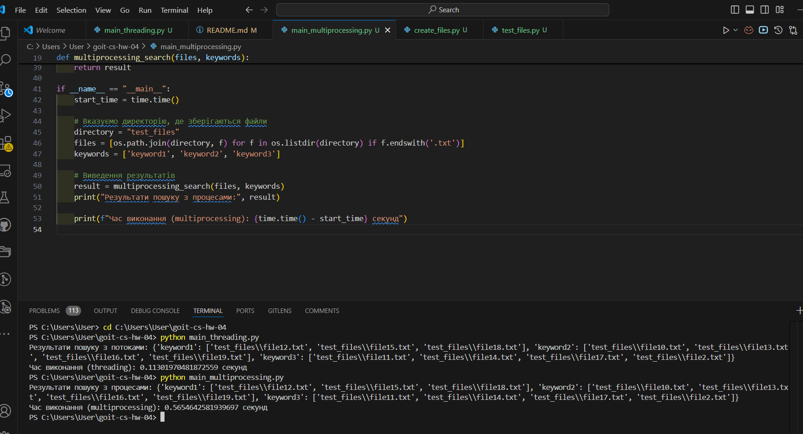

# goit-cs-hw-04

Висновки про отримані результати
1. Успішний пошук ключових слів:
Обидві версії програми — як багатопотокова (threading), так і багатопроцесорна (multiprocessing) — успішно виконали пошук ключових слів у файлах. Ключові слова keyword1, keyword2, і keyword3 були знайдені у відповідних файлах:
keyword1 знайдено в файлах: file12.txt, file15.txt, file18.txt.
keyword2 знайдено в файлах: file10.txt, file13.txt, file16.txt, file19.txt.
keyword3 знайдено в файлах: file11.txt, file14.txt, file17.txt, file2.txt.

2. Час виконання:
Час виконання багатопотокової версії склав 0.113 секунд, що є досить швидким для задачі пошуку ключових слів у 30 файлах.
Час виконання багатопроцесорної версії був довшим — 0.565 секунд, що характерно для обробки з використанням кількох процесів, особливо при відносно невеликих обсягах даних.

3. Порівняння багатопотокової і багатопроцесорної версій:
Багатопотокова версія виконала задачу швидше, ніж багатопроцесорна. Це очікуваний результат при роботі з невеликою кількістю файлів, оскільки створення нових процесів у багатопроцесорній версії потребує більше ресурсів і часу.
Багатопроцесорна версія може бути кориснішою при значно більших обсягах даних, оскільки вона краще масштабується при великій кількості файлів або складних обчисленнях.

Загальний результат:
Обидві версії програми працюють коректно, ключові слова успішно знаходяться у файлах, а час виконання для обох підходів залишається прийнятним.
Для даного випадку з невеликою кількістю файлів (30 файлів), багатопотокова версія є ефективнішою і виконується швидше.